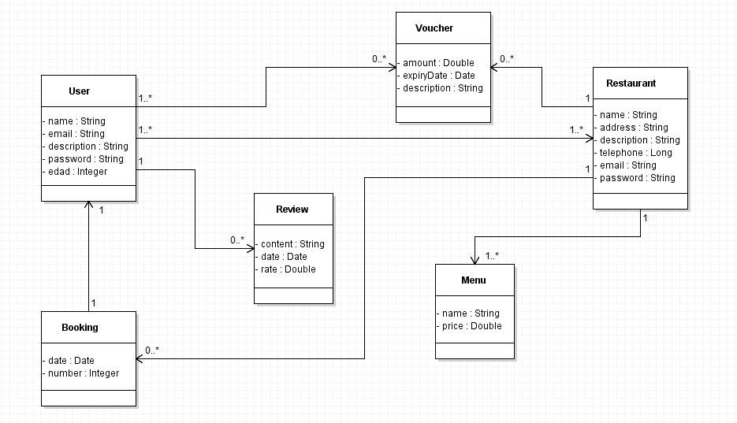
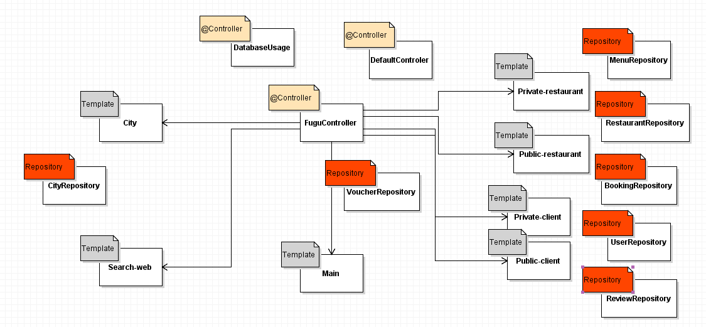
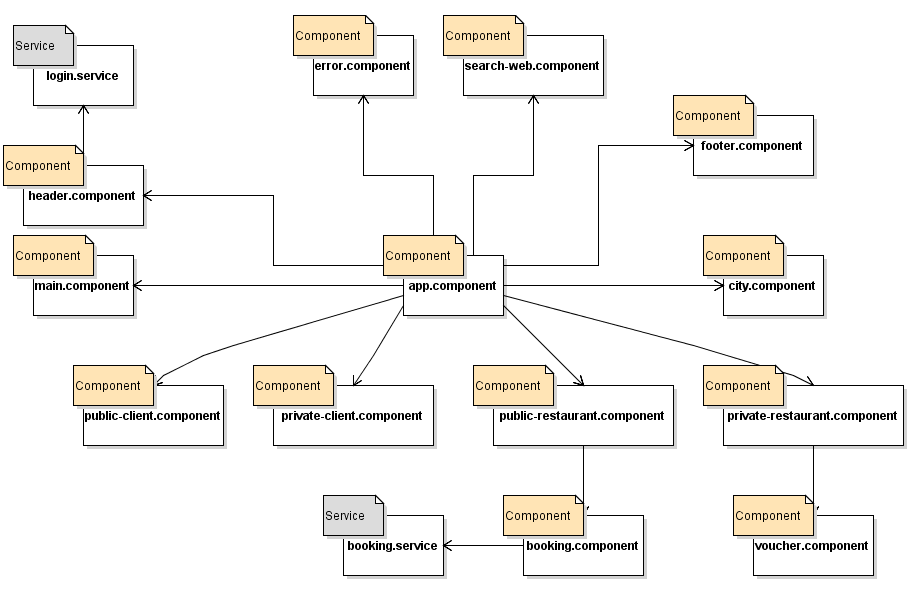
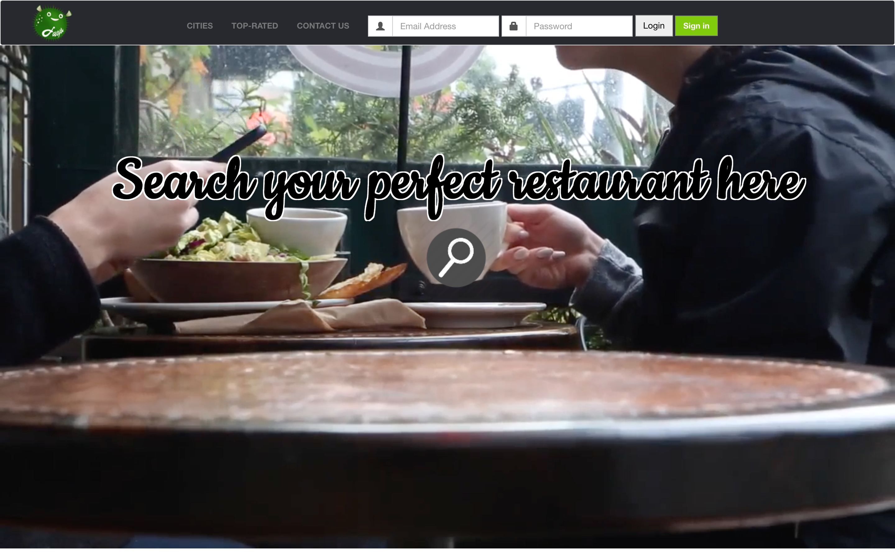
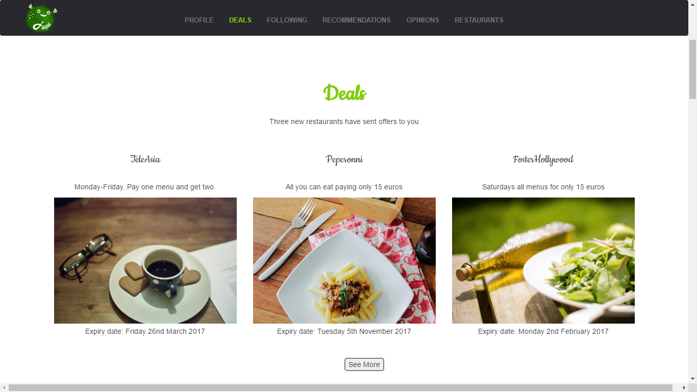
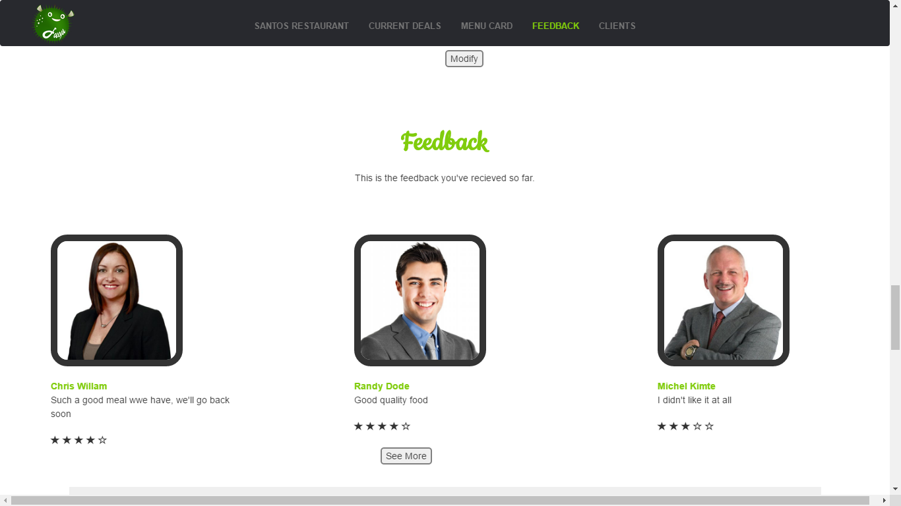
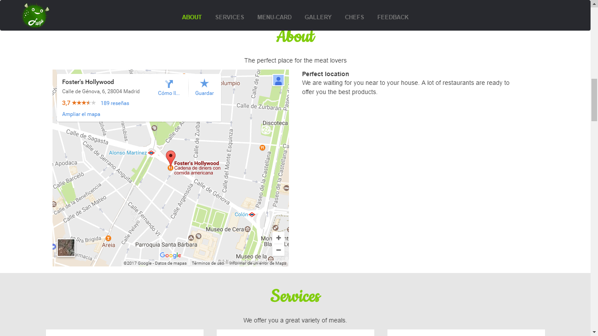
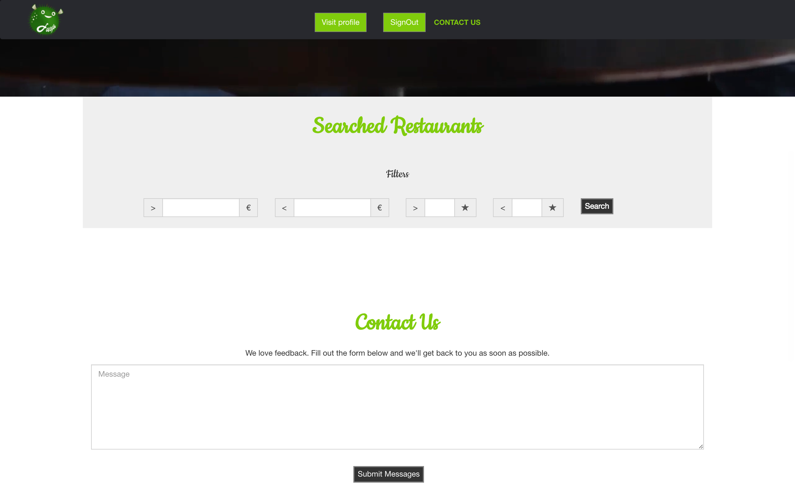

# Fugu 
### Description
* __This is a restaurant browser web with a search engine.__   
Both sign up as restaurant and user options availables. As user, you can see the restaurant page, send feedback and rate them. The restaurant user can upload the menu info, discounts and vouchers, and information about the address and who's the chef
  * The private part is the admin's.
  * The public part is the  restaurant's and profile's.
* __Users__:
  * Restaurant user.
  * Admin user.
  * Profile user.
* __Entities:__
  * User: Username, password, name, surname, age, starred restaurants, reviews, user rate.  
  * Restaurant: Name, address, rate, menu, vouchers and discounts.
  * Review: Username of the user that wrote it, review, rate and date.
  * Vouchers: Name, description, expiration day and amount.
  * Booking: Restaurant name, date and hour, name of the user that books the table, number of people on the table.
* __Authors:__
 * **Eloy Alfageme Galeano** [@ealfageme] (https://github.com/ealfageme)  
  Contact: e.alfageme@alumnos.urjc.es
 * **Sergio Rivas Delgado**       [@srivasd] (https://github.com/srivasd)  
 Contact: s.rivasd@alumnos.urjc.es
 * **Hector Dominguez Diego**     [@HDominguezD] (https://github.com/HDominguezD)  
 Contact: h.dominguezd@alumnos.urjc.es
 * **Sergio Paniego Blanco**      [@sergiopaniego] (https://github.com/sergiopaniego)   
 Contact: s.paniego@alumnos.urjc.es
 
* __[Trello's Board](https://trello.com/b/CYp9X8sK/fugu)__

* __[API Documentation](/API.md)__

* __[Docker-Hub](https://hub.docker.com/r/ealfageme/fugu/)__
  * sudo docker pull ealfageme/fugu:v0.1
  * sudo docker run ealfageme/fugu:v0.1
* __Cool Features:__
  * Log in using Facebook
 
* __[Template](https://webthemez.com/city-cafe-restaurant-bootstrap-4-free-website-template/)__
    * We have left the footer, we have modified the navbar, we have created a fugu logo, we have included a browser, we have left the contact us secion in some pages, and we have left the font type, and we have added other pages based on the main page style.
* __Classes Diagram__
    
* __Templates Diagram__
    
* __Components Diagram__
    
* __Navigation Board__
    
     
 * __Pages:__

* __Main page__
    
    
    
    
      * Description: This is the first page you can see in our application. You have a login section and a sign in section too. If you only want to see some superficial information you have some sections to inspect our services.
* __City__
    
    
    
      * Description: In this page we can choose one city to see a restaurant´s list oredered by their punctuation.
* __Private client__
    
    
    
      * Description: Similar to the previous page, but in this case, you have to be identified and you can change some properties about your personal details.
* __Private restaurant__
    
    
    
    
    * Description: If you are identified like a restaurant, you have the possibility of change offers, menu or send offers to a potential group of clients.
* __Public client__
    
    
      * Description: This is the client profile that everyone can see. For example you can check a following section, profile section, and finally, an opinion section about some restaurants.
* __Public restaurant__
    
    
    
    
      * Description: This is the public page of a restaurant that every user can see. You can see a menu, a photo gallery, some details like location or telephone number, and a contact section.

* __Search page__
    
    
      * Description: If you want to search a restaurant according to your tastes, this is the perfect page. You have some filters and inputs fields in order to find your perfect place.
    
    

    
