# Fugu
### Description
* __This is a restaurant browser web with a search engine.__   
Both sign up as restaurant and user options availables. As user, you can see the restaurant page, send feedback and rate them. The restaurant user can upload the menu info, discounts and vouchers, and information about the address and who's the chef
  * The private part is the admin's.
  * The public part is the  restaurant's and profile's.
* __Users__:
  * Restaurant user.
  * Admin user.
  * Profile user.
* __Entities:__
  * User: Username, password, name, surname, age, starred restaurants, reviews, user rate.  
  * Restaurant: Name, address, rate, menu, vouchers and discounts.
  * Review: Username of the user that wrote it, review, rate and date.
  * Vouchers: Name, description, expiration day and amount.
  * Booking: Restaurant name, date and hour, name of the user that books the table, number of people on the table.
* __Authors:__
 * **Eloy Alfageme Galeano** [@ealfageme] (https://github.com/ealfageme)  
  Contact: e.alfageme@alumnos.urjc.es
 * **Sergio Rivas Delgado**       [@srivasd] (https://github.com/srivasd)  
 Contact: s.rivasd@alumnos.urjc.es
 * **Hector Dominguez Diego**     [@HDominguezD] (https://github.com/HDominguezD)  
 Contact: h.dominguezd@alumnos.urjc.es
 * **Sergio Paniego Blanco**      [@sergiopaniego] (https://github.com/sergiopaniego)   
 Contact: s.paniego@alumnos.urjc.es
 
* __[Trello's Board](https://trello.com/b/CYp9X8sK/fugu)__
 
* __[Template](https://webthemez.com/city-cafe-restaurant-bootstrap-4-free-website-template/)__

* __Diagrama de Navegacion__
    
    
* __Main page__
    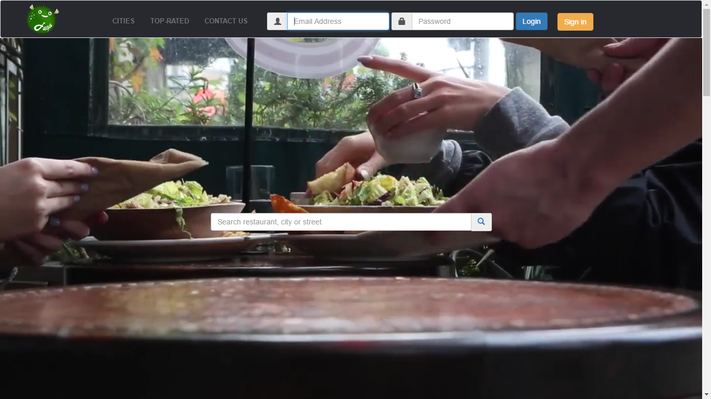
    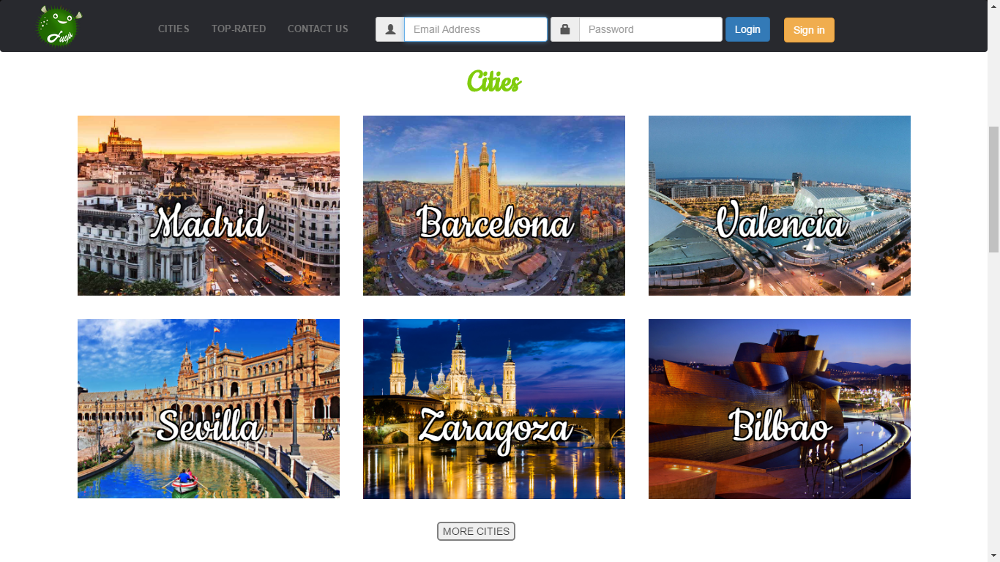
    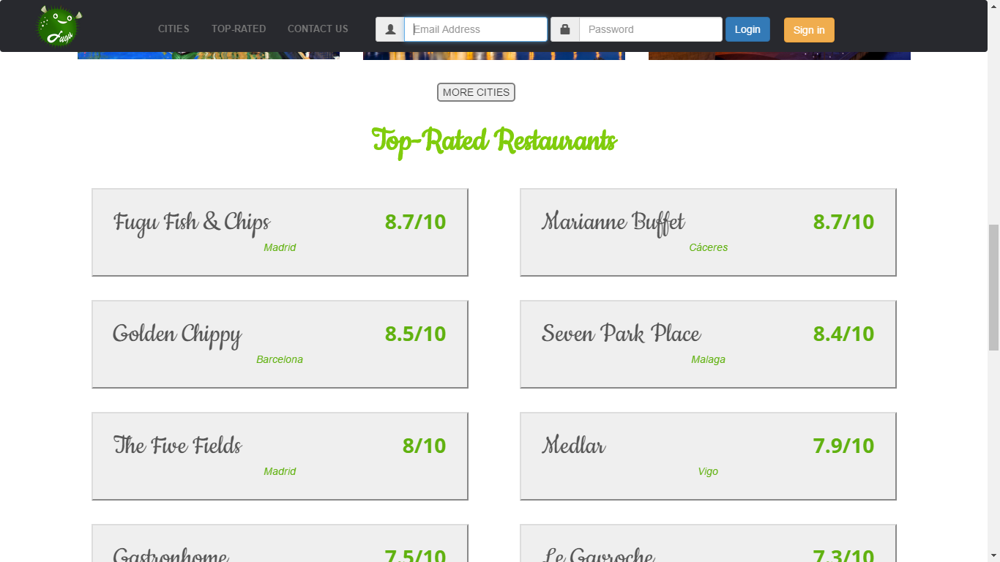
    
* __City__
    
    
    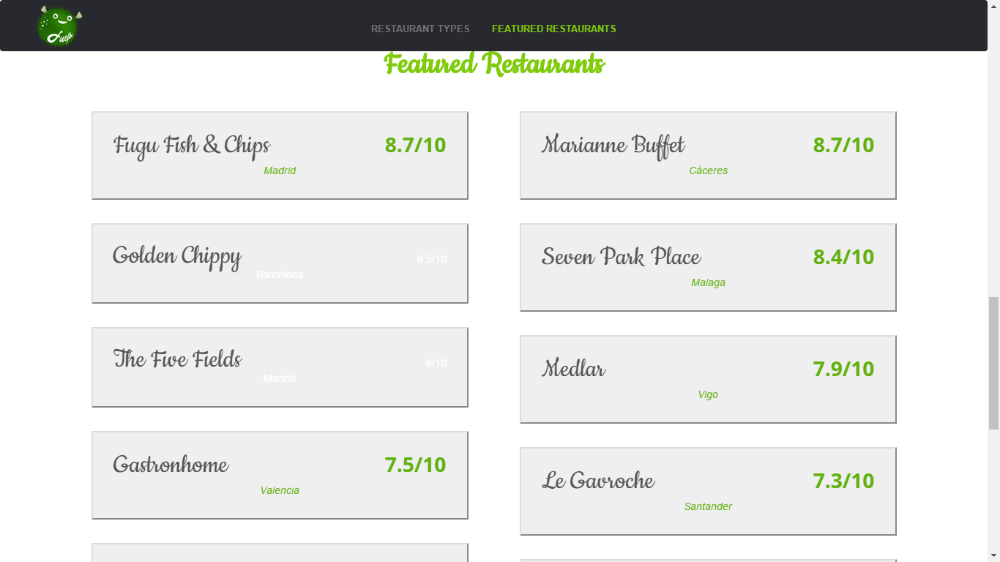
    
* __Private client__
    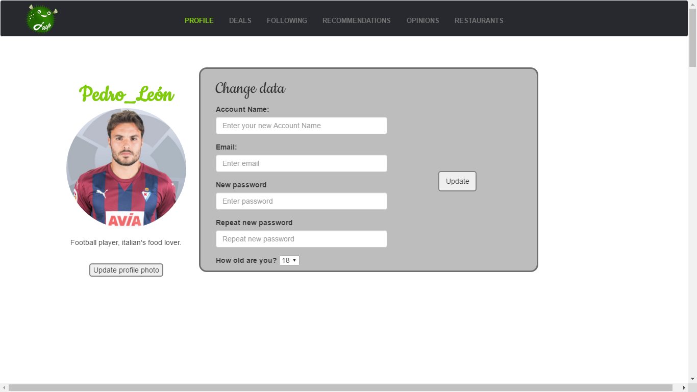
    
    
    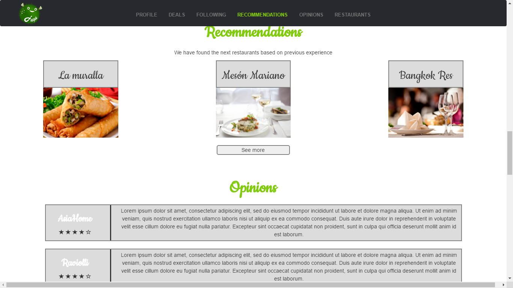
    
    
* __Private restaurant__
    
    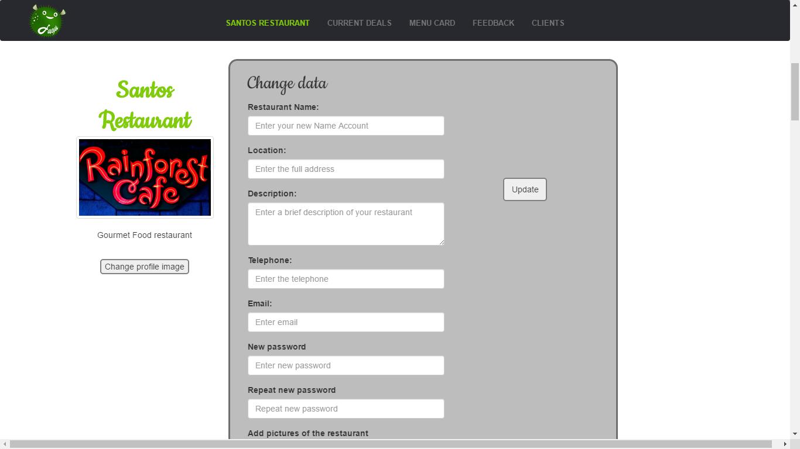
    
    
    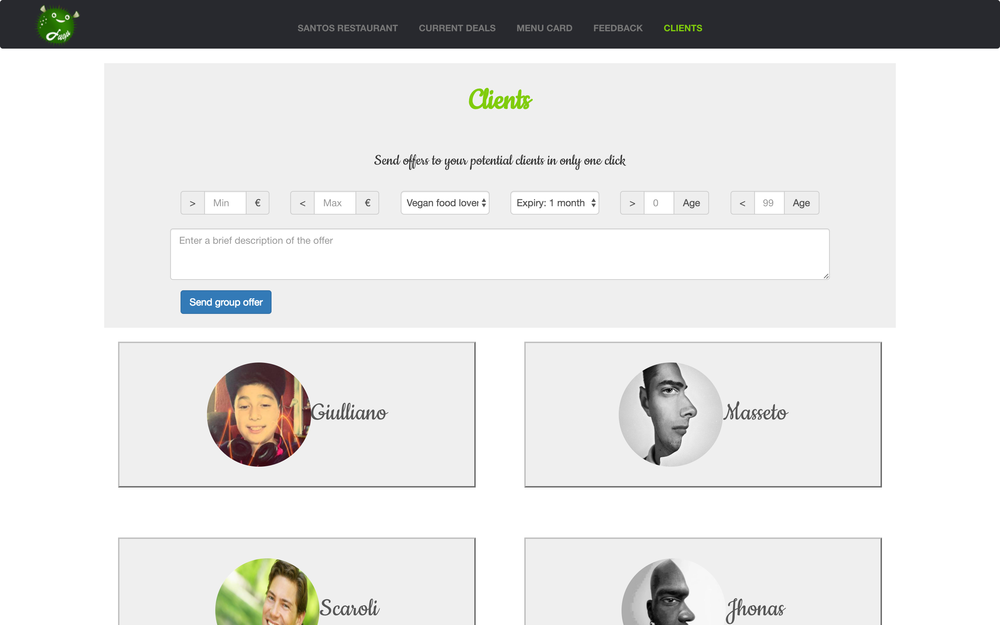
    
* __Public client__
    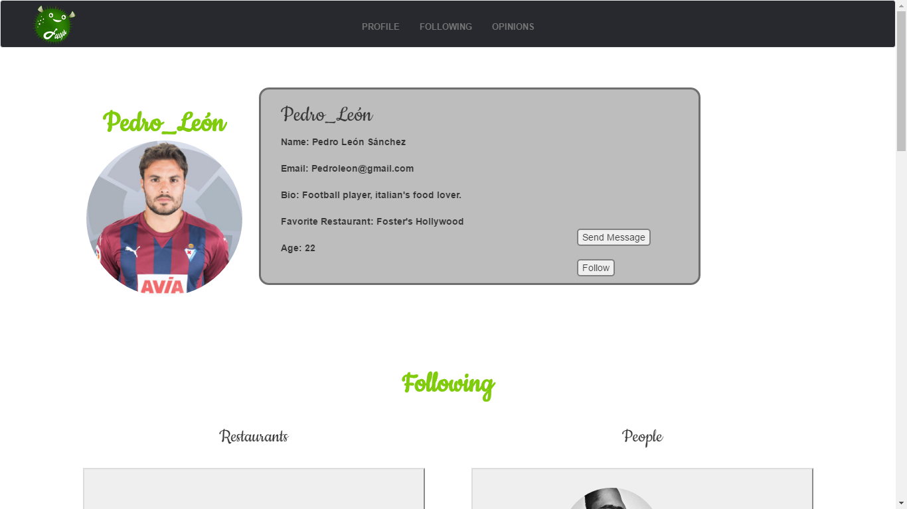
    
* __Public restaurant__
    
    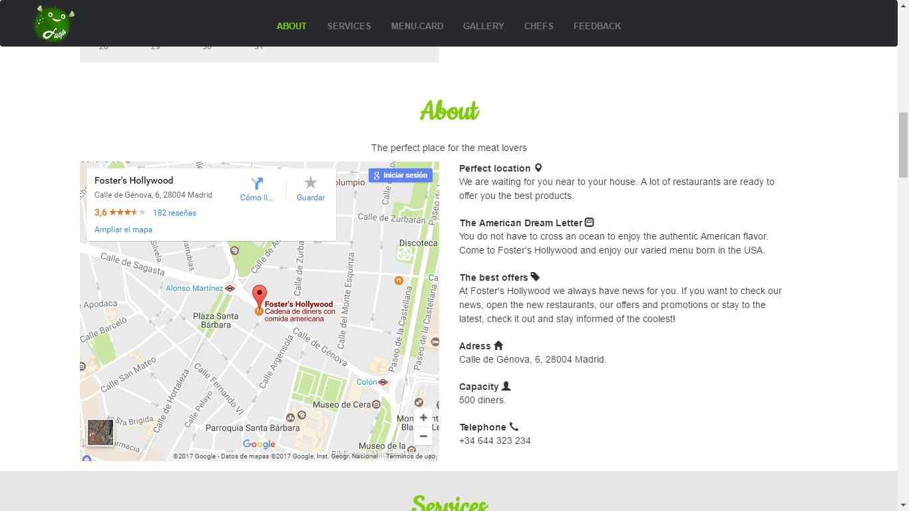
    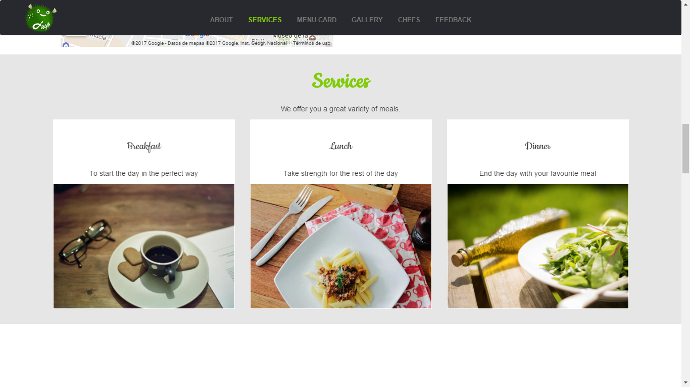
    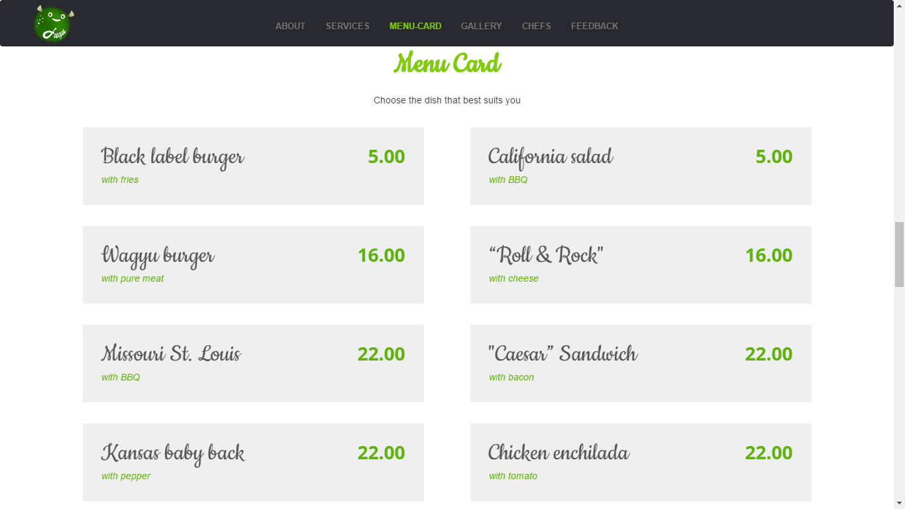
    
    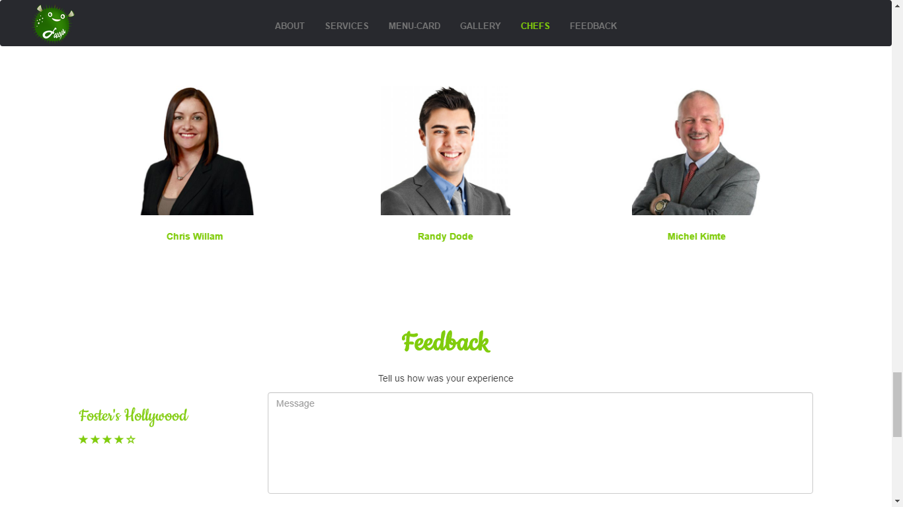
    

* __Search page__
    
    
    
    

    
